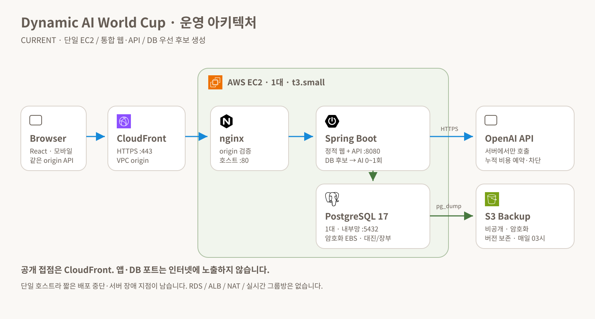
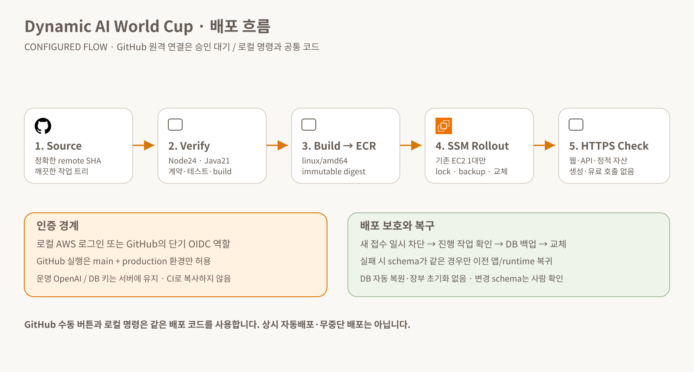

# 심사용 제한 해제와 반복 배포

2026-09-20 · TD-57. 이번 요청 전에는 `verify.yml`의 main push/PR 자동검증만 있었고, 운영 배포는 수동 SSM 명령이었다. CI 파일이 존재한다는 이유로 CD까지 구성됐다고 설명하지 않는다.

## 현재 상태

- 최신 TD-59 소스 `c24c80c`도 기존 로그인 갱신 후 같은 로컬 진입점으로 배포 완료했다. 검증→이미지→백업→교체→HTTPS가 자동 실행됐고 기존 데이터/예산을 보존했다. GitHub API에서 release/verify workflow는 확인했지만 Environment 목록은 비어 있었다. CI와 로컬 배포 자동화는 사용 가능하며 GitHub→AWS 원격 배포 연결은 아직 미완료다. 콘솔에서 수동으로 서버를 조작한 것이 아니라 로컬 배포 인증을 갱신한 것이다.
- 심사용 일일 cap0를 운영에 적용했다. 같은 익명 사용자로 DB16강3회 READY·추가AI0을 확인했다. 일반 기본2·burst·예산은 유지한다.
- 로컬 로그인과 GitHub OIDC가 같은 `scripts/release-aws.mjs` 진입점을 쓰도록 구현했다. 기존 AWS 로그인으로 소스 `a08d5a3`의 검증→빌드→백업→배포→HTTPS 확인을 실제 완료했다.
- GitHub 원격 OIDC 역할·production Environment·main 통합·수동 버튼 활성화는 사용자 답변 대기다. GitHub에 운영 권한은 아직 부여하지 않았다.
- 테스트 및 실제 적용 증거는 [검증 기록](VERIFICATION.md), [배포 기록](DEPLOYMENT.md)으로 구별한다.

## 운영 구조는 유지



CloudFront에서 HTTPS를 종료하고 VPC origin으로 EC2 nginx에 연결한다. React 정적 파일과 Spring API는 하나의 앱 이미지에 묶이고 PostgreSQL은 같은 EC2의 별도 컨테이너/EBS에 있다. 카탈로그 후보와 비용·경기 기록은 DB에 저장된다. AI 키·DB 암호는 서버에만 두며 배포 때 읽어 CI로 가져오지 않는다. 새 서버·RDS·NAT·ALB는 만들지 않는다.

단일 호스트를 유지한 이유는 심사 일정과 현재 규모에서 비용·운영 복잡도를 줄이기 위해서다. 무중단/고가용성 구조는 아니므로 배포 중 짧은 접속 중단과 단일 장애 지점이 남는다.

## 배포 흐름



1. 깨끗한 작업 트리·정확한 commit과 신뢰된 원격 브랜치 tip을 확인한다. GitHub는 main의 명시적 수동 실행만 허용한다.
2. 기존 `scripts/verify.sh`를 수행한다. 유료 실험 플래그는 false다.
3. 같은 commit의 `linux/amd64` 이미지를 빌드하고 source label을 붙인다. 기존 private ECR에 올린 뒤 digest로 고정한다.
4. AWS 계정·기존 프로젝트 인스턴스·이미지 저장소를 검증하고 작은 runtime 묶음의 체크섬과 함께 SSM으로 보낸다. 신규 저장소 권한이나 공개 SSH는 필요 없다.
5. 호스트에서 배포 lock을 얻고 유입을 잠시 막은 뒤 진행 중 생성 작업을 다시 확인한다. 앱 교체 전 기존 runtime/설정과 DB 백업을 보존한다.
6. 새 앱의 digest/revision·준비 상태와 외부 HTTPS 웹/API/정적 파일을 확인한다. 이 검사는 후보 생성이나 AI 호출을 하지 않는다.

실패 시 DB migration 기록이 그대로인 경우에만 이전 앱/runtime으로 복귀한다. DB가 변경됐거나 진행 중 작업을 안전하게 비울 수 없으면 자동 DB 복원·장부 초기화를 하지 않고 사람이 확인한다. SSM 요청의 응답이 유실됐을 때도 무작정 재전송하지 않는다. 배포 성공 여부는 명령 접수·프로세스 종료 코드가 아니라 실제 실행 이미지와 HTTPS 결과로 판단한다.

## 심사 모드

| 설정 | 의미 |
| --- | --- |
| `GENERATION_DAILY_LIMIT=0` | 일일 생성 횟수 제한만 해제 |
| `GENERATION_DAILY_LIMIT=2` 또는 설정 누락 | 일반 하루2회, 한국 시간 자정 초기화 |
| actor/IP burst | 두 모드 모두 10분에5회 유지. 쿠키 초기화로 IP 제한을 우회하지 못하게 함 |
| `CANDIDATE_BUDGET_USD=5` | 기존 운영 누적 AI 한도. 일/월마다 새로5달러가 되는 예산이 아님 |

심사 모드는 하루 제한 해제이지 무제한 지출 승인이 아니다. 전체 재생성1회·접수 기록·동일 요청 재전송·실패/rollback 회계·비용 예약은 그대로다. 심사가 끝난 뒤2로 되돌릴 수 있으며 기존 기록은 삭제하지 않는다. 바쁜 심사장에서 같은 IP를 공유하면 burst 제한이 적용될 수 있다. 공유 링크 플레이는 새 생성 요청이 아니므로 해당 생성 제한/추가 AI 호출이 없다.

배포 전 보충 질문 재제출에서429를 받아 대기시간이 저장된 탭은 그 시간이 남을 수 있다. 새로고침만으로 해제된다고 안내하지 않는다. 현재 그 경로에는 대기 취소 버튼이 없어 즉시 시연은 **새 시크릿 창**에서 서비스 URL을 연다. 운영의 일일 cap0과 기존 클라이언트가 저장한 Retry-After는 다른 상태다. 사용자 입력/게임 기록을 몰래 초기화하거나 실제 burst 대기를 무시하지 않았다.

## GitHub 원격 연결 경계

GitHub OIDC는 장기 AWS access key를 GitHub에 보관하지 않고 실행마다 단기 권한을 얻는 방식이다. 이 저장소는 immutable subject를 사용하므로 repo 이름만 넣은 예전 trust 예제를 복사하지 않고 실제 OIDC customization 응답을 사용한다. AWS는 정확한 audience와 subject를 검사하고, production Environment에는 main만 허용하는 branch rule을 설정해야 한다. [GitHub 공식 OIDC 안내](https://docs.github.com/en/actions/how-tos/secure-your-work/security-harden-deployments/oidc-in-aws)

검토할 최소 역할 템플릿은 [github-deploy-role.json](../deploy/aws/github-deploy-role.json)이다. 한 ECR 저장소와 한 EC2 인스턴스/AWS-RunShellScript에 쓰기·실행을 제한하고 IAM 변경·비밀 조회·다른 서비스 수정 권한은 주지 않는다. 다만 **해당 호스트의 SSM 명령 실행은 사실상 root 권한**이다. 신뢰된 배포 코드가 서버의 비밀에 접근할 수 있다는 위험은 여전히 남으므로 공개 PR/fork에 이 권한을 주면 안 된다. [AWS Run Command 권한](https://docs.aws.amazon.com/systems-manager/latest/userguide/run-command-setting-up.html)

외부 workflow action은 검증한 SHA로 고정한다. repo에는 운영 키/비밀번호·개인 계정 설정을 넣지 않는다. 배포 target의 비밀 아닌 식별자도 로컬 외부 config 또는 GitHub Environment 변수에 둔다. 실제 Environment·role·main 통합 없이 이 파일과 workflow만 추가한 상태는 ‘버튼 배포 사용 가능’이 아니다.

## 로컬에서 한 명령으로 배포

Node24·Java21·Docker(amd64 build 가능)·AWS CLI 로그인과 `npm ci`가 필요하다. 역할이 허용한 기존 운영 자원만 지정한다. 대상 JSON은 Git 밖의0600 파일로 관리한다. 아래는 형식 예시이며 실제 식별자는 운영자가 외부에서 제공한다.

```json
{
  "account": "<12-digit-account>",
  "region": "ap-northeast-2",
  "instance": "<existing-worldcup-instance>",
  "repository": "<existing-worldcup-ecr-name>",
  "host": "<existing-cloudfront-host>",
  "bucket": "<existing-worldcup-backup-bucket>"
}
```

변경을 commit/push한 뒤 정확한 원격 branch tip을 지정한다. main이 아직 최신 앱을 포함하지 않아 현재 작업 브랜치를 명시한다. 일반 재배포는 `--quota keep`, 심사 모드는0, 심사 종료 후 복귀는2다. 이 옵션으로 AI 누적 예산은 변경할 수 없다.

```sh
node scripts/release-aws.mjs \
  --revision <full-40-character-commit-sha> \
  --branch feat/engine/context-feasibility \
  --config /private/path/worldcup-release.json \
  --quota 0
```

필요하면 `--aws-cli /absolute/path/to/aws-wrapper`, `--builder <existing-buildx-builder>`를 지정한다. 변경된 파일·원격tip 불일치·다른 AWS계정/인스턴스에서는 빌드 전에 중단한다. SSM command ID가 출력된 이후 실패/응답 불명확이면 command history와 호스트 릴리스 기록을 먼저 확인하고 같은 배포를 무작정 재실행하지 않는다. DB/비용 장부를 삭제하거나 백업으로 덮어 재시도하지 않는다.

호스트 기록은 `/opt/worldcup/releases/release-<revision>-<suffix>/`에 남는다. runtime-before·이전metadata·schema fingerprint·private log·성공revision/image/ready를 포함한다. 백업은 기존 private S3로 보낸다. 로그/설정/백업은 비공개이며 Git/Actions artifact로 올리지 않는다. 디스크 정리와 새 스키마의 복원 리허설은 별도 운영 작업이다.

## 승인 후 GitHub 버튼 활성화 순서

1. 최신 앱과 workflow를 main으로 통합한다. 오래된 main에 workflow만 옮겨 완성 앱 배포라고 하지 않는다.
2. GitHub `production` Environment에 main만 허용하는 branch rule을 설정한다. repo의 실제 OIDC subject와 기존 AWS provider를 확인한 뒤 별도 role template의 정확한 subject/provider/한 ECR/한 인스턴스만 승인한다.
3. Environment 변수 `AWS_RELEASE_ACCOUNT_ID`, `AWS_RELEASE_INSTANCE_ID`, `AWS_RELEASE_ECR_REPOSITORY`, `AWS_RELEASE_HOST`, `AWS_RELEASE_BACKUP_BUCKET`, `AWS_DEPLOY_ROLE_ARN`을 설정한다. API키/DB암호/장기 AWS키는 넣지 않는다.
4. Actions의 `release AWS`에서 main의 정확한40자리 revision과 quota를 입력해 수동 실행한다. 자동 push 배포가 아니다. verify·빌드·배포·HTTPS 확인은 로컬과 같은 코드다.
5. 실제 Actions run·실행 이미지/설정·외부 HTTPS를 확인한 뒤에만 활성화 완료로 표시한다.

현재 위 원격 권한 부여와 main 변경은 실행하지 않았다. workflow는 main 수동실행만 허용하고 PR/fork에서는 운영 자격을 발급받는 경로가 없다. 다만 main에 악성 코드를 합치면 배포 권한으로 호스트에 영향을 줄 수 있으므로 신뢰된 변경 검토는 필수다.
